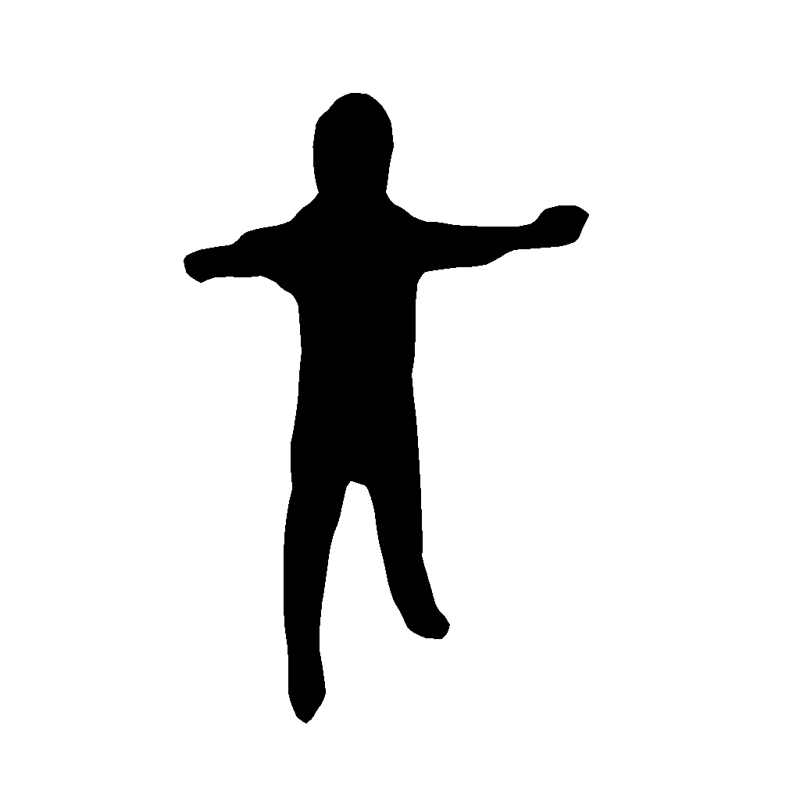
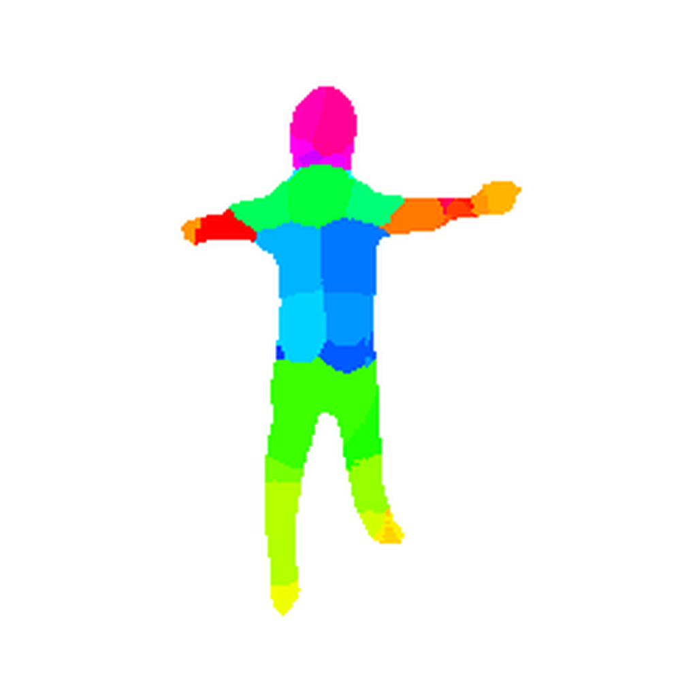
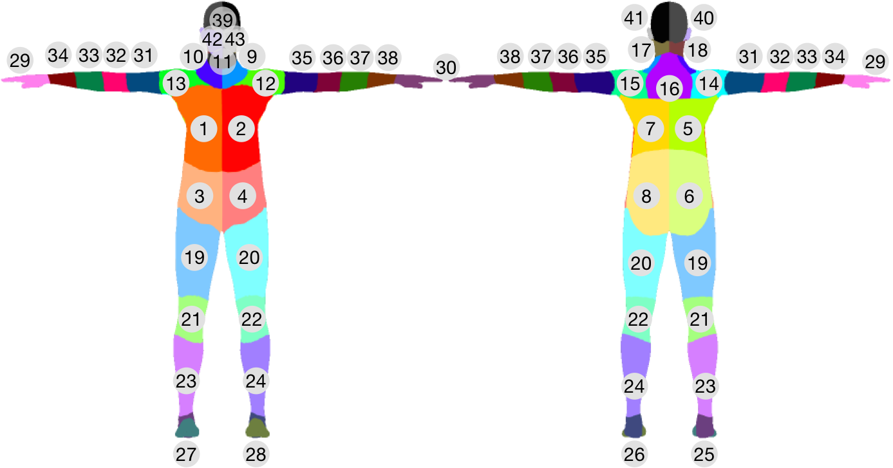

# body-segmentation
Body segmentation test based in dense classification of the depth images to recognize the body parts (2021)

| *BRemNet* mask | *BRemNet* mask segmented |
| --- | --- |
|  |  |

## Installation
Clone this repository:
```
git clone https://github.com/aletrujim/body-segmentation.git BodySegmentation
```
## Dataset
The data used in this analysis were acquired with *BRemNet* (Background Removal Network) from [*body2vec*](https://doi.org/10.3390/jimaging6090094).
If you use this data or the method for acquiring your own masks dataset in your research, please cite this project.
```
@article{trujillo2020body2vec,
  title={body2vec: 3D Point Cloud Reconstruction for Precise Anthropometry with Handheld Devices},
  author={Trujillo-Jim{\'e}nez, Magda Alexandra and Navarro, Pablo and Pazos, Bruno and Morales, Leonardo and Ramallo, Virginia and Paschetta, Carolina and De Azevedo, Soledad and Ruderman, Anah{\'\i} and P{\'e}rez, Orlando and Delrieux, Claudio and others},
  journal={Journal of Imaging},
  volume={6},
  number={9},
  pages={94},
  year={2020},
  publisher={Multidisciplinary Digital Publishing Institute}
}
```

## Segmentation reference


## Acknowledgments
Real-Time Human Motion Capture with Multiple Depth Cameras. Project page [here](https://arxiv.org/abs/1605.08068)

